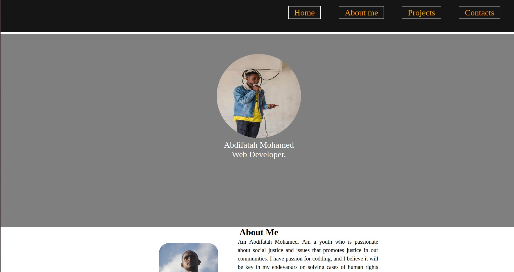

# My Portfolio

## Author

Abdifatah Mohamed

## Description

- This is my portfolio website, for my school project.
- The project was created by combining HTML and CSS technologies.

## Language Used

- Html
- CSS

## Set up instructions
- Network Connection.
- Open through Desktop or Phone.
- ctlt + alt + t to open terminal.
- Navigate to Desktop.
- Navigate to Portfolio.
- Initialize git on terminal.
 ## Project ScreenShot
 
 - Screenshot of my portfolio.

##  Link
- https://abdifatah135.github.io/My-portfolio-website/

##  Licence
- The project has no licence, free to use by anyone.
- Copyright 2019.
